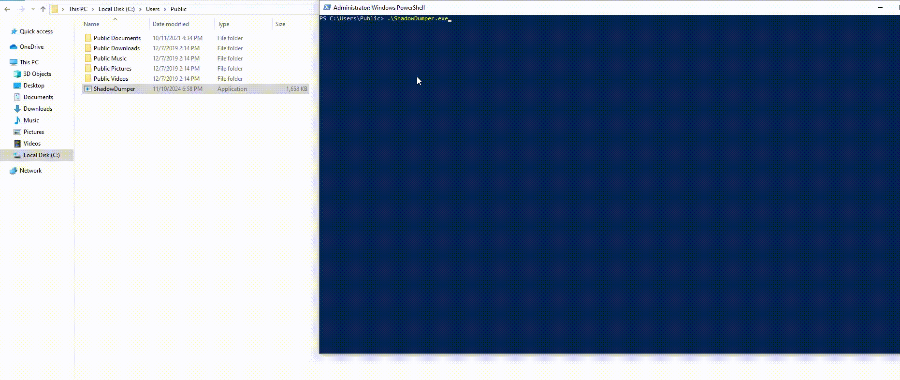

# ShadowDumper
<p align="center">
  
</p>

Shadow Dumper is a powerful tool used to dump LSASS (Local Security Authority Subsystem Service) memory, often needed in penetration testing and red teaming activities. It offers flexible options to users and uses multiple advanced techniques to dump memory, allowing to access sensitive data in LSASS memory.   


> [!CAUTION]
> It's important to note that this project is only for educational and research purposes, and any unauthorized use of it could lead to legal consequences.

## 🚀 Capabilities
- **Unhooked Injection (Modified Mimikatz Binary)** – Utilizes unhooking to inject a modified Mimikatz binary, bypassing EDR hooks and evading detection.
- **Unhooked Injection (Direct Syscalls with MDWD)** – Implements direct syscalls for stealthy injection using MDWD, reducing the footprint left behind.
- **Simple MiniDumpWriteDump API** – Executes the straightforward MiniDumpWriteDump API method for standard LSASS memory extraction.
- **MINIDUMP_CALLBACK_INFORMATION Callbacks** – Uses callback functions for custom handling, offering greater control over the dumping process.
- **Process Forking Technique** – Forks the LSASS process, creating a memory clone and avoiding direct access to the target process.
- **Direct Syscalls with MiniDumpWriteDump** – Combines direct syscalls with MiniDumpWriteDump, enhancing stealth by avoiding typical API hooks.
- **Native Dump with Direct Syscalls (Offline Parsing)** – Leverages direct syscalls to create a native dump with essential streams for offline parsing, perfect for low-noise operations.

## 🛠️ Build
- Clone ShadowDumper repository
- Open in Visual Studio 2019 (v142)
- C++ Language Standard ISO C++14 Standard or Higher
- Download the shellcodes **pan.bin and off.bin** from [Resource Shellcodes] folder, place them somewhere in your computer and change the path in ShadowDumper.rc file before compiling. 
- Make sure MASM should be selected. [Right-click on your project in solution explorer, click build dependencies, click build customization and select .masm]
- Right click on ASM files and go to properties and make sure item type should be Microsoft Macro Assembler
- Compile project

> [!NOTE]
> V1.0 Compatibility: Windows (x64) [Tested with x64 build] on Windows 10 Version 22H2 (OS build 19045.5487) with major 10.0
[You may face issues on latest releases in some methods, this can be due to version of mimikatz]

## ⛑️ Usage
To run ShadowDumper, execute the compiled binary from the powershell.

**Default Mode (V1.0)**
- No Parameter Provided: Show the user friendly console with multiple options to execute
<p align="center">
  
</p>

**Default Mode (V2.0)**
- No Parameter Provided: Show the user friendly console with multiple options to execute
<p align="center">
  
</p>


**CommandLine Mode (V1.0)**
- Parameter: -h: Displays a help menu with all available options.
<p align="center">
  
</p>

**CommandLine Mode (V2.0)**
- Parameter: -h: Displays a help menu with all available options.
<p align="center">
  
</p>

```cpp
  ShadowDumper.exe
    - Parameter: 1: To dump lsass memory using unhooking technique to inject modified mimikatz binary [Token Elevation, SAM Dumping, Vault Credentials, Lsass Hashes Dumping].

  ShadowDumper.exe
    - Parameter: 2:  To dump lsass memory using unhooking technique to inject binary using direct syscalls with MDWD.

  ShadowDumper.exe
    - Parameter: 3: To dump lsass memory using simple MiniDumpWriteDump API.

  ShadowDumper.exe
    - Parameter: 4: To dump lsass memory using MINIDUMP_CALLBACK_INFORMATION callbacks and encrypt the dumps before writing on disk as per your choice.

  ShadowDumper.exe
    - Parameter: 5: To dump lsass memory using process forking technique and encrypt the dumps before writing on disk as per your choice.

  ShadowDumper.exe
    - Parameter: 6:  To dump lsass memory using direct syscalls with MiniDumpWriteDump.

  ShadowDumper.exe
    - Parameter: 7:   To dump lsass memory using direct syscalls (native dump with needed streams for parsing offline).
  
   ShadowDumper.exe
    - Parameter: 8:   To decrypt the dump file before offline parsing with tools like (mimikatz or pypykatz).
```


## 💫 Demonstration
Demonstrates the working of ShadowDumper (V1.0).



Demonstrates the working of ShadowDumper (V1.0).


## 🔄 Upcoming
```cpp
- Defense Evasion Techniques: Add more advance defense evasion techniques.

- Exfiltrate: Exfiltrate dump file over C2 server.

- Enhancement: Add more techniques to dump lsass memory. 

Stay tuned for future releases!

```
## 🤳 Contact
Have questions, ideas, or want to collaborate? Reach out to the [author](https://offensive-panda.github.io) for a conversation, or jump right in and contribute via GitHub Issues. Let's make something great together!

## 🙏 Acknowledgment
- Took help in nativedump streams from the Project by **Florinel Olteanu** called [**NtDump**](https://github.com/florylsk/NtDump).
- Injected modified mimikatz by **Benjamin DELPY** called [**Mimikatz**](https://github.com/gentilkiwi/mimikatz).


